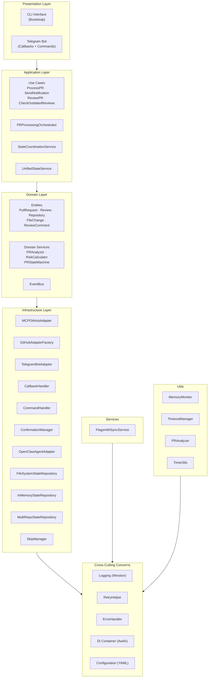
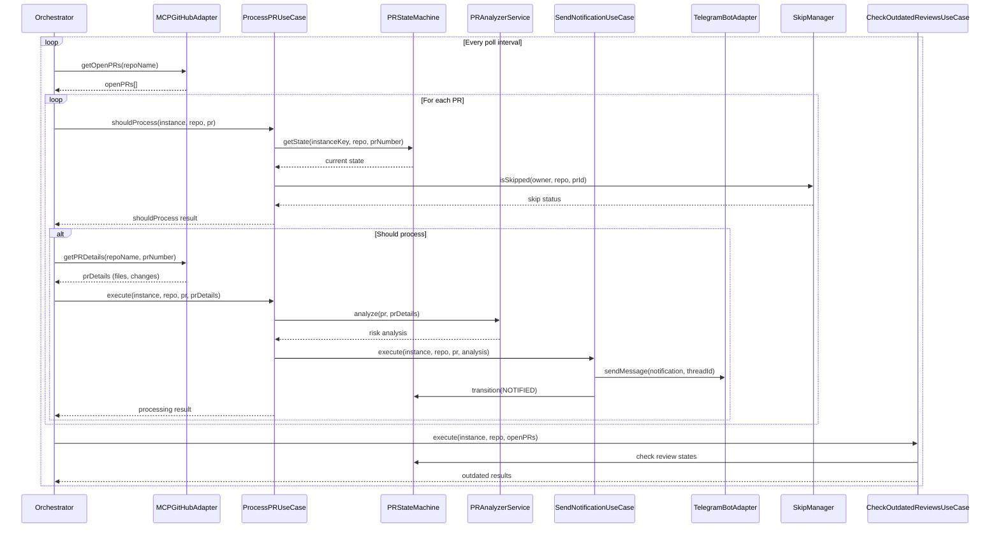
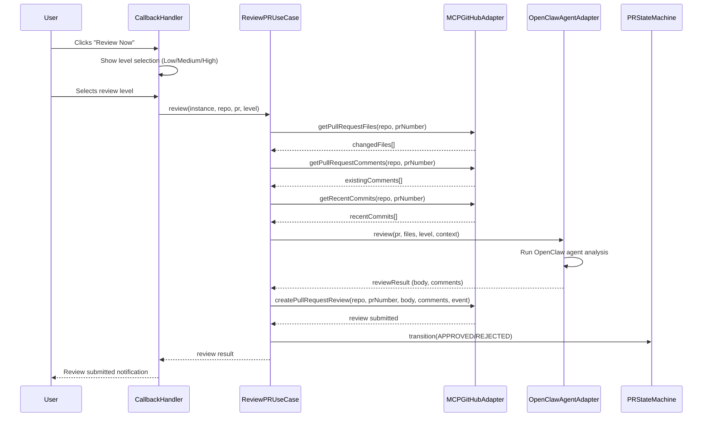
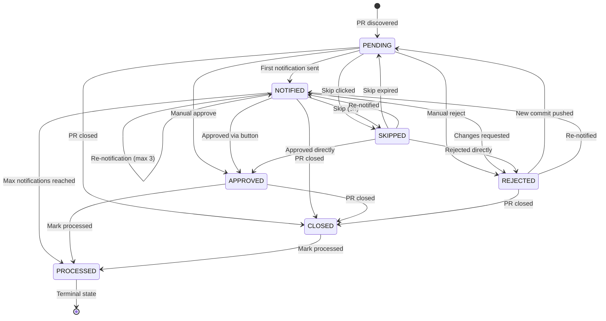
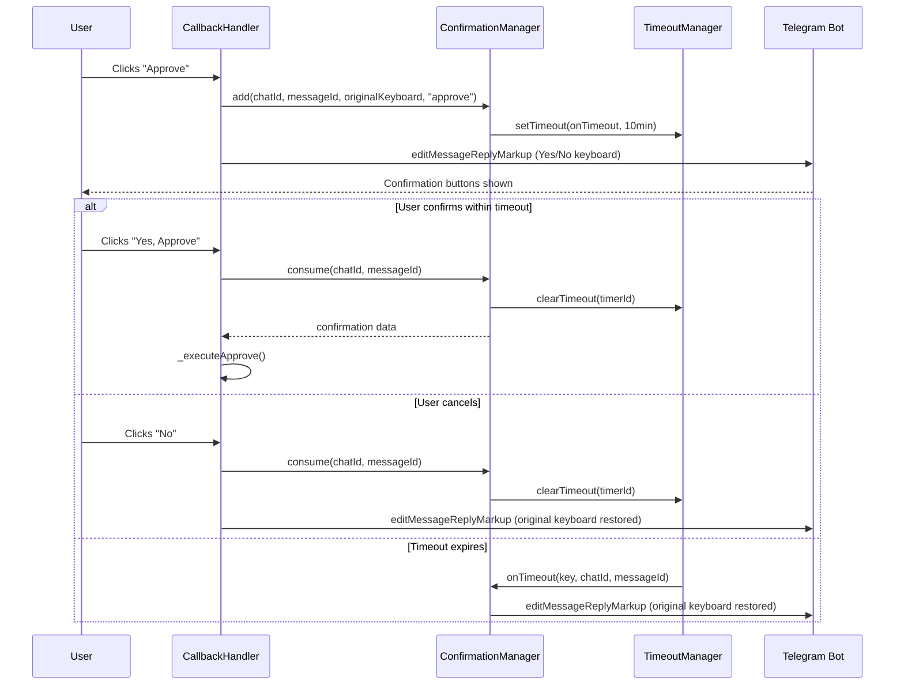
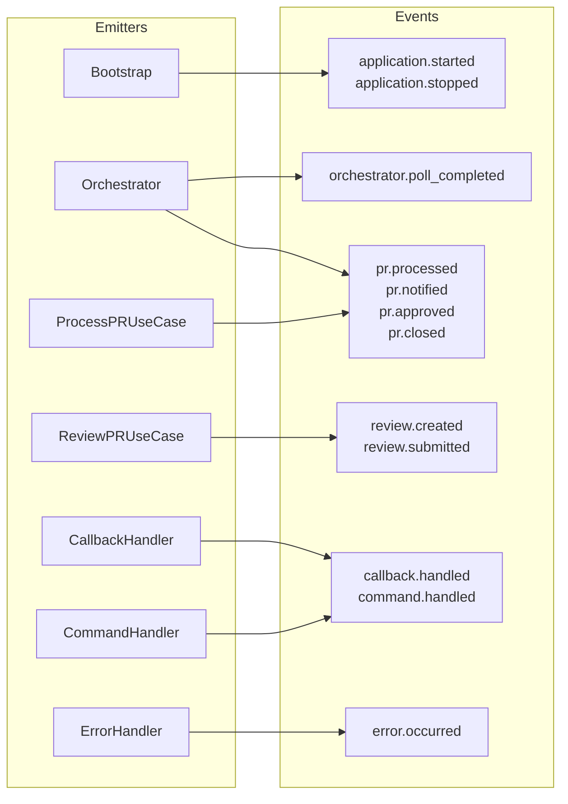

# Multi-Instance PR Monitor Daemon

[](https://nodejs.org)
[](LICENSE)
[](https://pm2.keymetrics.io)
[]()

A production-grade Node.js daemon that monitors GitHub Pull Requests across multiple instances and repositories using OpenClaw MCP (Model Context Protocol) tools, provides AI-powered code reviews with configurable intensity levels, and delivers real-time notifications via Telegram bot.

## Overview

This daemon is designed for teams that want automated PR monitoring with intelligent code review capabilities without managing complex infrastructure. It polls GitHub for open PRs, tracks notification history, and provides actionable insights through Telegram notifications with inline action buttons.

Built on **Clean Architecture** principles with dependency injection (Awilix), event-driven communication, and an MCP-first design where all GitHub operations go through Model Context Protocol tools — no direct GitHub REST API calls.

## Key Features

- **Clean Architecture**: Layered architecture with clear separation of concerns (Domain, Application, Infrastructure, Presentation)
- **Dependency Injection**: Awilix-based DI container for loose coupling and testability
- **Multi-Instance Support**: Monitor multiple GitHub organizations with different MCP servers
- **Multi-Repository**: Track multiple repositories per instance with independent state management
- **Per-Repo Telegram Threads**: Each repository has its own Telegram thread for organized notifications
- **MCP-First Architecture**: All GitHub operations use OpenClaw MCP tools — no direct REST API calls
- **AI-Powered Reviews**: Three configurable review levels (Low/Medium/High) with different focus areas
- **Smart Notifications**: Each PR notified up to 3 times with skip option and snooze/quiet hours support
- **Telegram Integration**: Interactive bot with inline buttons for Review, Approve, Reject, Close, and Skip, plus text commands (`/reset`, `/status`, `/help`)
- **Approval Confirmation Flow**: Two-step approval with configurable timeout and automatic keyboard restoration
- **Remote Configuration**: Flagsmith sync with periodic polling, retry logic, and atomic writes
- **Memory Monitoring**: Three-tier (warning/critical/restart) with auto-GC and graceful restart
- **Snooze / Quiet Hours**: Time-based and weekend notification suppression (WIB timezone)
- **Timeout Management**: Centralized timer tracking for clean shutdown and leak prevention
- **Repository-Scoped State**: All tracking data persisted per repository — survives restarts without duplicates

## Architecture



## Getting Started

### Prerequisites

- **Node.js** >= 18.0.0
- **npm** package manager
- **OpenClaw MCP** installed and configured
- **mcporter** CLI tool for MCP server management
- **Telegram Bot** created via [@BotFather](https://t.me/botfather)
- **PM2** (recommended for production)
- **Flagsmith** account (optional, for remote configuration)

### Installation

```bash
# Clone the repository
git clone <repository-url>
cd agent-pr

# Install dependencies
npm install

# Create configuration file
cp config.yml.example config.yml

# Edit config.yml with your settings
nano config.yml
```

### Configuration

The daemon uses `config.yml` for configuration. See `config.yml.example` for the full template.

**Core Configuration:**

| Setting | Description | Default |
|---------|-------------|---------|
| `app.check_interval_minutes` | PR polling frequency in minutes | 7 |
| `app.outdated_review_check_minutes` | Outdated review check interval (0 = every poll) | 10 |
| `app.telegram.bot_token` | Telegram bot token from @BotFather | Required |
| `app.telegram.chat_id` | Main Telegram chat ID | Required |
| `app.approve_confirmation_timeout_minutes` | Approval confirmation timeout in minutes | 10 |
| `{instance}.mcp_name` | MCP server name for this instance | Required |
| `{instance}.max_age_hours` | Maximum PR age to process | 48 |
| `{instance}.skip_cache_duration_hours` | Skip cache duration when user clicks Skip | 3 |
| `{instance}.agent.review` | OpenClaw agent name for reviews | Required |
| `{instance}.agent.level` | Available review levels | `[low, medium, high]` |
| `{instance}.agent.review_timeout_seconds` | Review timeout in seconds | 1200 |
| `{repo}.thread_id` | Telegram thread ID for this repo's notifications | Required |

**Snooze / Quiet Hours:**

| Setting | Description | Default |
|---------|-------------|---------|
| `app.snooze_time.enabled` | Enable quiet hours for notifications | true |
| `app.snooze_time.start_hour` | Snooze start hour (WIB) | 20 |
| `app.snooze_time.end_hour` | Snooze end hour (WIB) | 6 |
| `app.snooze_time.skip_weekends` | Skip notifications on weekends | true |

**Flagsmith Remote Config (optional):**

| Setting | Description | Default |
|---------|-------------|---------|
| `app.flagsmith.enabled` | Enable Flagsmith remote configuration | false |
| `app.flagsmith.environment_id` | Flagsmith environment ID | - |
| `app.flagsmith.identity` | Flagsmith identity for user-specific flags | - |
| `app.flagsmith.sync_interval_minutes` | Sync interval in minutes | 5 |

### Running the Application

```bash
# Development mode (auto-restart)
npm run dev

# Production
npm start

# With PM2 (recommended)
pm2 start ecosystem.config.js
```

## Flows & Diagrams

### PR Processing Pipeline

The main polling loop runs every `check_interval_minutes`, iterating through all configured instances and repositories.



### AI Review Flow

Triggered when a user clicks the "Review Now" inline button and selects a review level.



### PR State Machine

Manages the lifecycle of a PR from discovery through processing. Each PR can be notified up to 3 times before being auto-marked as processed.



### Approval Confirmation Flow

Two-step approval with a configurable timeout. If the user doesn't confirm within the timeout, the keyboard automatically reverts to its original state.



### Event System

The EventBus enables decoupled communication between components using a pub/sub pattern with priority support, wildcards, and metrics.



## Telegram Bot Commands

Commands are scoped by `thread_id` — they only work within repo-specific Telegram threads.

| Command | Description |
|---------|-------------|
| `/reset` | Reset PR processing state for the current repository |
| `/status` | Show current processing status and statistics for the repo |
| `/help` | Display available commands |

Commands are handled by `CommandHandler` (`src/infrastructure/telegram/CommandHandler.js`), which resolves the repository from the Telegram thread ID and routes the command accordingly.

## Callback Data Format

All inline button interactions use a compact format to stay within Telegram's 64-byte callback data limit.

**Format patterns:**

| Pattern | Format | Example |
|---------|--------|---------|
| Standard | `action:instanceIdx:repoIdx:prId` | `approve:0:1:42` |
| With level | `review_level:instanceIdx:repoIdx:prId:level` | `review_level:0:1:42:medium` |
| With reviewId | `approve_outdated:instanceIdx:repoIdx:prId:reviewId` | `approve_outdated:0:1:42:98765` |
| Outdated + level | `review_level_outdated:instanceIdx:repoIdx:prId:reviewId:level` | `review_level_outdated:0:1:42:98765:high` |
| Confirmation | `cfm_y:instanceIdx:repoIdx:prId` | `cfm_y:0:1:42` |

**All callback actions:**

| Action | Format Parts | Description |
|--------|-------------|-------------|
| `review_now` | 4 | Show review level selection (Low/Medium/High) |
| `visit` | 4 | Send PR URL in chat |
| `review_cancel` | 4 | Cancel and delete review selection message |
| `approve` | 4 | Trigger two-step approval confirmation |
| `cfm_y` | 4 | Confirm approval (Yes) |
| `cfm_n` | 4 | Cancel approval (No) |
| `reject` | 4 | Request changes on PR |
| `close` | 4 | Close the PR |
| `skip` | 4 | Skip notifications for 3 hours |
| `review_level` | 5 (level) | Execute AI review at selected level |
| `approve_outdated` | 5 (reviewId) | Approve an outdated review |
| `re_review` | 5 (reviewId) | Re-review an outdated PR |
| `dismiss_outdated` | 5 (reviewId) | Dismiss outdated review notification |
| `review_level_outdated` | 6 (reviewId + level) | Review outdated PR at selected level |

## Development

### Testing

```bash
# Run all tests
npm test

# Run with coverage
npm run test:coverage

# Run in watch mode
npm run test:watch

# Run specific test suite
npm test -- --testPathPatterns="integration"

# Lint
npm run lint
npm run lint:fix
```

Test files mirror the source structure in `tests/`:
- `tests/unit/core/` — Domain layer tests
- `tests/unit/application/` — Application layer tests
- `tests/unit/infrastructure/` — Infrastructure layer tests
- `tests/unit/shared/` — Cross-cutting concerns tests
- `tests/integration/` — Integration tests

### Adding Features

1. **New Domain Entity**: Create in `src/core/entities/` with encapsulated business logic
2. **New Domain Service**: Create in `src/core/services/`, keep pure business logic with no external dependencies
3. **New Use Case**: Create in `src/application/use-cases/`, orchestrate domain services
4. **New Adapter**: Implement interface in `src/infrastructure/`, register in `Container.js`
5. **New Event**: Emit via `EventBus`, document in comments
6. **Register**: Add to `Container.js` with appropriate lifecycle (SINGLETON, SCOPED, or TRANSIENT)

### State Management

Repository-scoped state is persisted to `data/instances/{org}/{repo}/`:
- `processed_prs.json` — Fully processed PRs (after 3 notifications or approval)
- `notification_counts.json` — Notification counts per PR (max 3)
- `skip_cache.json` — Temporary skips with expiry timestamps
- `processed_timestamps.json` — When PRs were marked as processed

### Retry Pattern

All external operations use `RetryHelper` with exponential backoff:
- MCP calls: 3 retries, 2s base, 2x multiplier
- Telegram: 3 retries, 3s base, 2x multiplier
- AI agents: 2 retries, 10s base, 2x multiplier

## Production Deployment

### PM2

The project includes an `ecosystem.config.js` configured for production use:

```bash
# Start daemon
pm2 start ecosystem.config.js

# Monitor
pm2 monit

# View logs
pm2 logs pr-monitor-daemon

# Stop / Restart
pm2 stop pr-monitor-daemon
pm2 restart pr-monitor-daemon
```

PM2 configuration:
- Single instance with shared state management
- 512MB memory limit with auto-restart
- Graceful shutdown with 5s kill timeout
- Log rotation with date formatting

### Binary Build

Create a standalone Linux binary using `pkg`:

```bash
npm run build
# Output: dist/agent-pr-monitor
```

The build process (`scripts/prebuild.js`) bakes version info into `.version.json` for runtime access.

### Memory Configuration

The production start script uses Node.js memory flags:

```bash
node --expose-gc --max-old-space-size=128 index.js
```

- `--expose-gc`: Enables programmatic garbage collection via `MemoryMonitor`
- `--max-old-space-size=128`: Sets V8 heap limit to 128MB

MemoryMonitor three-tier thresholds:
- **Warning** (70%): Log warning
- **Critical** (85%): Force garbage collection
- **Restart** (95%): Graceful shutdown and restart

## License

MIT License - see [LICENSE](LICENSE) file for details.

